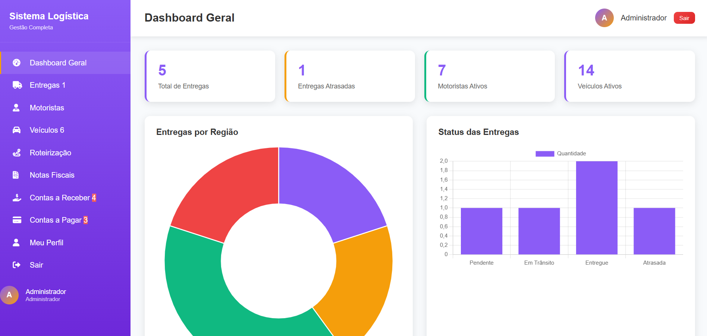

# Sistema de Logística

Este sistema tem como objetivo gerenciar operações logísticas, incluindo controle de entregas, motoristas, veículos, roteirização, notas fiscais e financeiro (contas a pagar e a receber).

## ⚙️ Estrutura

- O projeto **não utiliza um padrão de arquitetura como MVC**, o que torna a organização e a manutenção menos seguras e menos escaláveis.
- Todos os arquivos PHP estão misturados na raiz ou em pastas de includes.
- O código não faz separação clara entre regras de negócio, apresentação (views) e acesso a dados.

## 📂 Principais diretórios e arquivos

- `config/`
  - `config.php`: configurações gerais do sistema.
  - `database.php`: **arquivo onde é feita a configuração do banco de dados** (alterar credenciais aqui conforme ambiente).
  - `logistica.sql`: **arquivo SQL** com a estrutura do banco de dados (tabelas, inserts iniciais).
- `css/`: arquivos de estilo para telas e componentes.
- `includes/`: includes reutilizáveis (ex.: sidebar, verificação de login).
- `*.php`: páginas principais do sistema (dashboard, login, motoristas, entregas, etc.).

## 💡 Observação de segurança

> ❗ **Atenção:** O sistema não possui uma estrutura estratégica segura. Falta:
>
> - Separação de camadas (MVC).
> - Proteção contra SQL Injection.
> - Tratamento adequado de sessões e autenticação.
> - Sanitização e validação de dados.
>
> Recomenda-se implementar padrões como MVC ou frameworks que ofereçam camadas de abstração e segurança (ex.: Laravel, Symfony).

## 🚀 Executando

1. **Configurar banco de dados**
   - Crie um banco no seu servidor MySQL.
   - Importe o arquivo `logistica.sql` para criar as tabelas e inserir dados iniciais.

2. **Editar configuração de conexão**
   - No arquivo `config/database.php`, ajuste:
     ```php
     $host = "localhost";
     $dbname = "nome_do_banco";
     $user = "usuario";
     $pass = "senha";
     ```
3. **Acessar via navegador**
   - Inicie seu servidor local (XAMPP, WAMP, etc.).
   - Acesse `http://localhost/logistica`.

## 📸 Tela principal



## ✅ Funcionalidades

- Dashboard geral com gráficos.
- Controle de entregas (pendentes, em trânsito, entregues, atrasadas).
- Cadastro e gerenciamento de motoristas.
- Controle de veículos.
- Controle financeiro (contas a pagar e a receber).
- Perfil do usuário.

---

## 📢 Melhorias recomendadas

- Refatorar usando MVC para separar lógica, visual e dados.
- Adicionar uso de prepared statements ou ORM para evitar SQL Injection.
- Adicionar camadas de validação e sanitização.
- Implementar um sistema de permissões mais robusto.

---

👨‍💻 **Desenvolvido para estudos e demonstração de funcionalidades básicas.**
